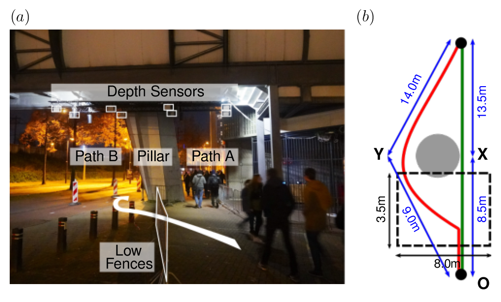

# Fluctuations in pedestrian dynamics routing choices.
## Pedestrian tracking at the Glow 19 festival (Eindhoven, The Netherlands)

### How to cite

- **Dataset**
```
A. Gabbana, F. Toschi, P. Ross, A. Haans, and A. Corbetta. (2022). 
Fluctuations in pedestrian dynamics routing choices. 
https://doi.org/10.5281/zenodo.7007358
```


- **Paper 1**
```
A. Gabbana, F. Toschi, P. Ross, A. Haans, and A. Corbetta. (2022). 
Fluctuations in pedestrian dynamics routing choices. 
PNAS Nexus. https://doi.org/10.1093/pnasnexus/pgac169
```


- **Paper 2**
```
Gabbana, A., Corbetta, A., & Toschi, F. (2022). 
Modeling Routing Choices in Unidirectional Pedestrian Flows. 
Collective Dynamics, 6, 1–9. https://doi.org/10.17815/CD.2021.135
```

In this notebook we provide a few examples of data analysis using the [dataset of 
trajectories](https://doi.org/10.5281/zenodo.7007358) recorder during the 
2019 [Glow festival](https://gloweindhoven.nl/) in the city of Eindhoven (The Netherlands)
by the [Crodflow group at Eindhoven University of Technology](https://crowdflow.phys.tue.nl)


The experimental setup, sketched in the figure below, was established on the perimeter of the
Philips Stadium, along the uni-directional route of the festival amid two consecutive festival exhibits. 
When approaching the setup, each pedestrian faced a binary choice: passing
an external pillar bearing the stadium grandstands either by its right or left side. Respectively, these
were a slightly shorter and approximately straight path, in the following referred to as path
A, and a curved path partially intersecting a bicycle lane (closed during the experiment),
named path B henceforth.

The experiment lasted the entire duration of Glow 2019, 
from November 9th until November 16th, 2019. 
The tracking was performed during the festival opening hours,
every day from 18:00 until 00:00.
Note that the data collected on the 14th of November has not been included, 
since on that day the experimental setup was modified in order to evaluate 
the impact of changing the lighting conditions on the crowd dynamic.

We acquired individual pedestrian trajectories at 30 Hz time resolution by means of
overhead depth images and the [HA-HOG localization method](https://doi.org/10.17815/CD.2020.30 ). 
We collected raw depth images of a walkable area of about $30 m^2$ via 8 Orbbec Persee sensors attached
underneath a pedestrian overpass, and arranged in a 4x2 grid (see dashed black line in the Figure below).



